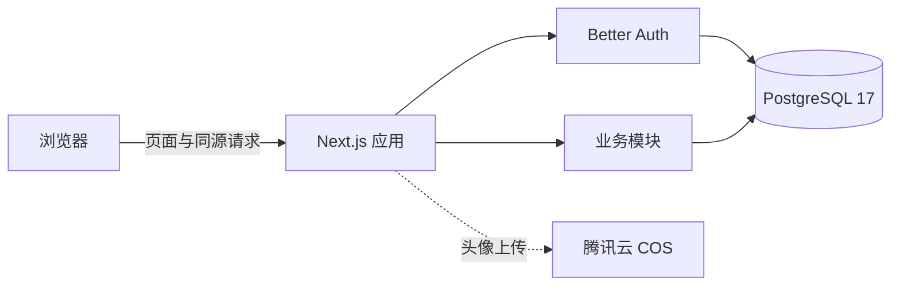

# JobTrace 架构

本文描述当前实现的系统边界、模块职责、数据流和关键约束。功能需求与验收标准保存在 [`specs/`](../specs/)，部署和故障处理见[运行与运维](operations.md)。

## 系统概览

JobTrace 是 Next.js App Router、TypeScript 与 PostgreSQL 组成的模块化单体。页面、同源 HTTP 接口、认证和业务服务运行在同一个 Node.js 应用中；浏览器不会直接连接数据库。

SQL 迁移位于 `supabase/migrations/`。该目录名沿用早期规格，但运行时使用服务端 PostgreSQL 驱动，不依赖 Supabase Auth、JWT 或客户端 RLS。

## 模块边界

主要依赖方向是 `app/UI → application → domain`。跨模块调用通过各模块的 `index.ts` 公开接口完成；客户端 UI 不得直接导入数据库或基础设施实现，这些约束由 ESLint 检查。

| 目录                          | 职责                                                              |
| ----------------------------- | ----------------------------------------------------------------- |
| `src/app`                     | 页面、布局、Server Components、Server Actions 与 Route Handlers。 |
| `src/modules/applications`    | 投递聚合、招聘阶段、历史事件、列表查询和 PostgreSQL 仓储。        |
| `src/modules/interviews`      | 面经聚合、Markdown 转换、自动保存、筛选和阶段关联。               |
| `src/modules/analytics`       | 首页摘要、跟进提醒、进度提醒与周期求职报告。                      |
| `src/modules/data-transfer`   | CSV/XLSX 解析、预检批次、投递导出和面经导出。                     |
| `src/modules/identity-access` | Better Auth、服务端 actor、个人资料、角色授权和管理后台。         |
| `src/shared`                  | 业务日期、游标、统一错误、日志、请求安全与数据库客户端。          |

每个业务模块内部按职责分为：

- `domain/`：稳定业务词汇、值域和验证规则，不依赖 UI 或基础设施。
- `application/`：用例、端口、查询解析和公开契约。
- `infrastructure/`：PostgreSQL、表格、对象存储等技术实现。
- `ui/`：组件和浏览器交互。

## 请求与写入模型

### 页面读取

Server Component 取得当前 actor 后直接调用应用服务，不通过自身 HTTP 接口绕行。首页并行读取投递列表和分析摘要；分析页直接执行只读实时聚合。需要用户交互的部分再交给 Client Component。

### 投递写入

1. Route Handler 或 Server Action 解析请求并取得 actor。
2. Zod 在应用边界校验日期、枚举、长度和 URL。
3. PostgreSQL 函数在一个事务内更新投递、递增 `version` 并追加历史事件。
4. 界面用响应中的权威记录局部更新，再在后台并行对账列表和统计。

状态专用接口只接收目标状态与当前 `version`；业务日期由服务端生成。版本不匹配返回 `409`，客户端回滚乐观状态，避免覆盖其他标签页或请求的修改。

### 面经自动保存

面经以 `application_stage_occurrences.id` 关联一次具体阶段，同一阶段类型可以在不同日期重复出现，但每个 occurrence 最多关联一篇面经。

编辑器对完整 Markdown 文档进行约 800ms 防抖保存。数据库事务替换聚合内容并递增版本；并发冲突返回 `409` 后自动保存停止。页面隐藏或离开时会用 keepalive 请求尽力提交最近修改，但这不是持久化成功的绝对保证。

历史结构化问题、反思和行动项会在读取时组合成 Markdown；用户首次编辑后收敛为当前文档模型。删除阶段会通过 `ON DELETE SET NULL` 解除关联，同时保留面经中的阶段与日期快照；删除投递会级联删除其面经。

### 数据导入

导入分为“预检”和“确认”两阶段：

1. 服务端读取首个工作表并逐行规范化、校验。
2. 以同一 owner 下的公司、岗位和投递日期识别重复候选。
3. 预览及用户决策保存到有效期 24 小时的导入批次。
4. 确认时逐行调用正常的投递创建用例，不绕过验证、owner 隔离或历史事件。

详细字段和限制见[数据导入与导出](data-transfer.md)。

## 数据模型

| 聚合     | 主要表                                                                | 关键关系                                                   |
| -------- | --------------------------------------------------------------------- | ---------------------------------------------------------- |
| 身份     | `users`、`sessions`、`accounts`、`verification_tokens`                | Better Auth 持久化；用户带角色、禁用状态和访问版本。       |
| 投递     | `applications`、`application_stage_occurrences`、`application_events` | 阶段和事件属于投递；写入函数维护快照、版本和事件一致性。   |
| 面经     | `interview_reviews`、`interview_questions`、`interview_action_items`  | 面经属于投递，可关联具体阶段；问题和行动项随面经级联删除。 |
| 导入     | `import_batches`、`import_rows`                                       | 批次属于用户，保存预检、决策和逐行结果。                   |
| 提醒     | `progress_reminder_completions`                                       | 记录用户对具体阶段提醒的完成状态。                         |
| 管理审计 | `admin_audit_events`                                                  | 只追加记录访问变更的结果、原因和前后状态快照。             |

数据库中的状态和阶段使用稳定英文代码，中文仅是展示标签。业务日期统一按 `Asia/Shanghai` 自然日解释。

## 身份、授权与数据隔离

`proxy.ts` 只负责未登录页面的快速重定向，不能作为授权边界。每个受保护的页面、Server Action 和 Route Handler 都必须重新取得 actor：

- `requireUser`：要求有效且未禁用的用户。
- `requireAdmin`：在用户要求之上检查管理员角色。
- 仓储和 SQL 函数：对所有用户业务数据附加 `owner_id`。

跨 owner UUID 统一表现为未找到，避免泄露记录是否存在。公开注册永远创建普通用户；管理员身份只能通过受控引导或具名管理动作产生。禁用账号会在同一事务撤销其全部 Session。

所有 API 写请求在 Proxy 层拒绝跨站来源和超过 6 MB 的声明体积，业务处理器仍独立执行认证、角色和 owner 校验。认证和 COS 密钥只从未带 `NEXT_PUBLIC_` 前缀的服务端环境变量读取；头像还会校验实际文件签名。HTTP 错误统一返回 `code`、安全消息、`requestId` 和可选字段错误，响应头同时带 `x-request-id`。

## 审计与敏感数据

日志只记录定位问题所需的请求 ID、错误代码、操作、对象 ID、数量和耗时。以下内容不得写入应用日志或管理安全日志：

- Cookie、Session、认证 token 和密码；
- 投递备注、面经正文、问题、回答、反思和行动项；
- 管理访问原因、邮箱、IP 与 user-agent。

管理账号变更要求 10–500 字原因、目标 `accessVersion` 和稳定 `requestId`。成功、拒绝和冲突均写入只追加审计；查看用户求职档案只记录不含正文的安全元数据。

## 分析口径

- 首页摘要统计当前用户全部投递，并标记连续 15 个完整日未更新且仍为“已投递”的记录。
- 进度提醒面向已经发生但面经尚未完成的阶段，可由用户标记完成。
- 周期报告按投递日期形成 cohort，再把这些投递之后发生的阶段、面经和当前最终状态纳入报告。
- 总体 Offer 率包含所有 Offer；路径漏斗只计算具备完整前序阶段记录的 Offer，并单独报告数据质量。
- 报告为只读实时聚合，不保存可能随业务数据变化而漂移的统计快照。

## 运行时与扩展约束

- PostgreSQL 客户端单进程连接池最大连接数为 10；部署副本数会乘以该值，应纳入数据库连接预算。
- `next.config.ts` 使用 `output: "standalone"`，适合 Node.js 或容器部署；应用依赖动态请求、认证和数据库，不能部署为纯静态站点。
- 登录、注册和密码恢复通过 PostgreSQL 原子函数共享限流状态，适用于多实例部署；可信反向代理必须覆盖客户端提供的来源 IP 头。
- COS 只用于头像。所有业务记录、面经、导入批次、Session 和审计均保存在 PostgreSQL。
- `/api/health/live` 验证进程存活，`/api/health/ready` 验证数据库和关键结构；兼容接口 `/api/health` 保持原有响应契约。

## 进一步阅读

- [README 与本地启动](../README.md)
- [运行、部署与故障处理](operations.md)
- [数据导入与导出](data-transfer.md)
- [测试策略与命令](testing.md)
- [功能规格与数据模型](../specs/)

## 自动招聘市场边界

默认企业来源目录位于 `src/modules/job-market/application/default-source-catalog.ts`。它属于受审查的出站来源配置，而不是数据库 seed；截至 2026-09-01 包含 103 家可自动同步企业，并保持中国企业占多数。管理员初始化服务先验证每个 HTTPS 来源，再通过 `PostgresSourceCatalogRepository` 幂等持久化企业和来源，最后复用正常的来源认领与同步管线。因此，默认目录、手工登记和定时任务会产生相同的标准化岗位、生命周期事件、安全诊断与日志。

来源发现使用独立的 `job_market_source_candidates` 边界。管理员触发的扫描只检查目录中已登记的公开 HTTPS 招聘入口，识别受支持 ATS 链接或 `JobPosting` JSON-LD，并记录有界健康诊断；扫描不直接写入活动来源。只有管理员明确执行“批准并启用”后，审批事务才以候选中保存的精确主机白名单创建 `job_market_sources`。因此，自动发现不能绕过来源登记、访问依据审核或适配器注册表。

`src/modules/job-market` 是公共招聘数据的独立边界：`domain` 负责规范化、保守去重、生命周期和投递目标；`application` 负责编排查询、收藏、来源管理与同步；`infrastructure` 负责 PostgreSQL、受限 HTTP 和 ATS 适配器；`ui` 只消费聚合活动契约。私人投递仍由 `applications` 模块拥有，公共岗位只能通过 `jobMarketPostId` 建立一条 owner-scoped 关联和不可变快照。

每个适配器只接受管理员登记的来源，并输出统一的完整或部分批次。来源可持久化 ISO 两位国家代码范围；SmartRecruiters 在服务端请求中应用该范围，Greenhouse 与 Lever 在标准化前按中国大陆地点白名单过滤，Moka 适配器分页读取公开招聘官网接口并按社招/校招构造官方投递页，小米专用适配器访问官网岗位接口后也按中国大陆城市白名单执行失败关闭式过滤。默认中国市场目录将同一公司的岗位统一到公司卡片，使首页保持一家公司一行并合并岗位与地点；开放中的记录不会聚合已经关闭的历史岗位。新增适配器必须加入显式注册表，提供本地 fixture 契约测试，并遵守 HTTPS、精确主机白名单、DNS 公网地址、逐跳重定向、超时、响应大小和内容类型限制。Schema.org 适配器只解析 JSON-LD 和纯文本，不执行来源脚本。

去重依次使用同来源外部 ID、同公司规范官方 URL 和保守指纹；模糊或有歧义的数据保持分离并保留来源记录。完整成功快照第一次缺失变为 `stale`，至少六小时后的第二次缺失才 `closed`；失败或部分批次不推进缺失状态，重新出现记录 `reopened`。首页始终按“公司 + 招聘批次”返回一条活动，并合并其岗位与地点。

`job_market_campaign_favorites` 和 `application_job_market_links` 都以登录用户为 owner 边界。公共列表只能投影当前用户的收藏和已记录 ID，不得暴露其他用户的日期、状态、阶段、备注或面试数据。
